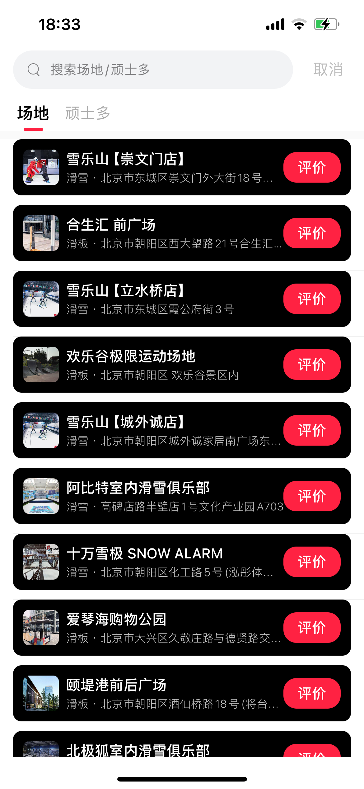

# Wanya App

New Youth Trend Culture Sanctuary

# This is open source software

MIT License

We attempted to operate an app to encourage more young people to explore new communities, including skateboarding, skiing, rap, and more. However, facing competition from platforms like Douyin and TikTok, we are unable to continue running the app, so we have decided to make it open source.

### This is the App on android and ios

You can visit app store by this link https://apps.apple.com/cn/app/id1529561853

And android can visit https://www.pc6.com/az/981024.html and install it.

### Screenshot

#### Home Page
| Home                      | Home switch tabs          | Home video                |
| ------------------------- | ------------------------- | ------------------------- |
|  |  |  |

| Home scroll               | post create                    | post detail                    |
| ------------------------- | ------------------------------ | ------------------------------ |
|  |  |  |

#### Friends and Chate page

| Friends List                 | Friend chat list                  | Chat view                         |
| ---------------------------- | --------------------------------- | --------------------------------- |
|  |  |  |

#### Login Page

| Phone login                | Password login             |
| -------------------------- | -------------------------- |
|  |  |

#### Mine page

| Mine                      | Mine setting              | Mine notice list               |
| ------------------------- | ------------------------- | ------------------------------ |
|  |  |  |

| Mine app setting                 |
| -------------------------------- |
|  |

#### Shopping Page

| Product List                      | Product detail                     |
| --------------------------------- | ---------------------------------- |
|  |  |

#### Topic Page

| topic index                    | page2                              |
| ------------------------------ | ---------------------------------- |
|  |  |

#### Other Pages

 | location index                    | location                              | search                         |
 | --------------------------------- | ------------------------------------- | ------------------------------ |
 |  |  |  |

### How to install it.
1. yarn install 
2. cd ios && pod install
3. yarn ios 

### Server App

The API and backend application were developed using Ruby on Rails and were entirely developed by me independently. However, some parts of the application involve sensitive information. If you are interested, please feel free to send me an email for further discussion.